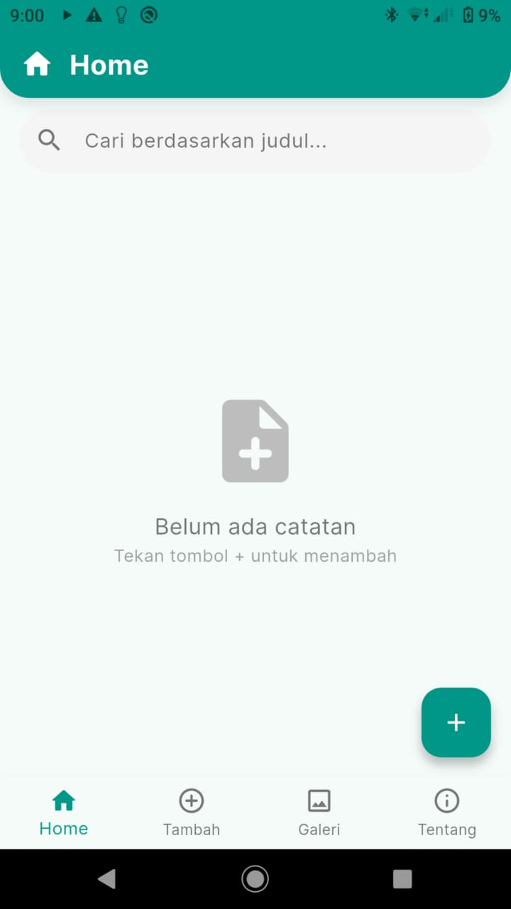
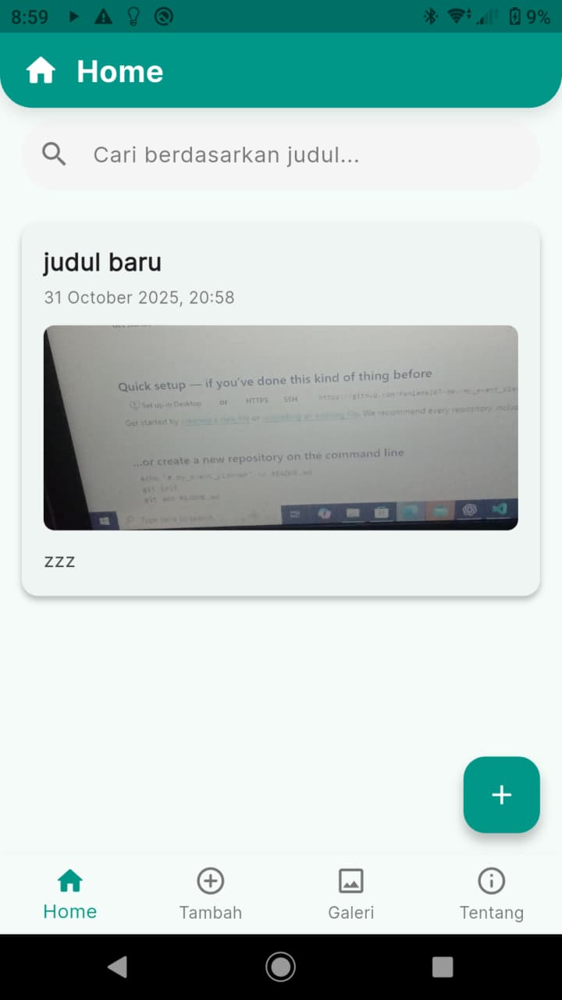
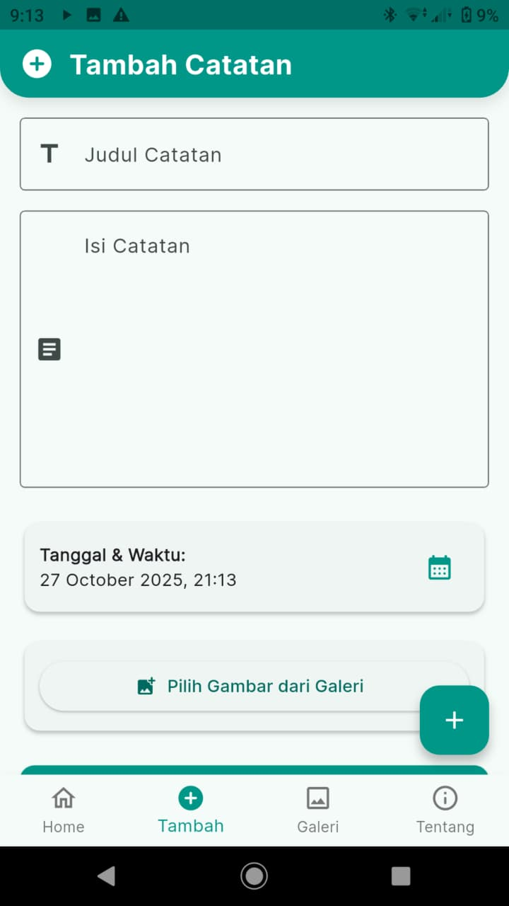
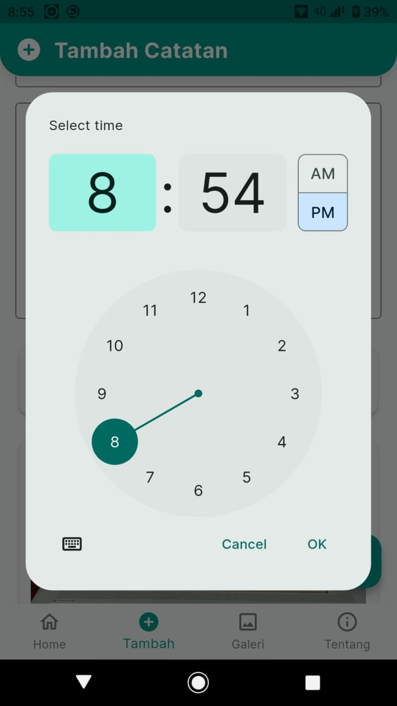
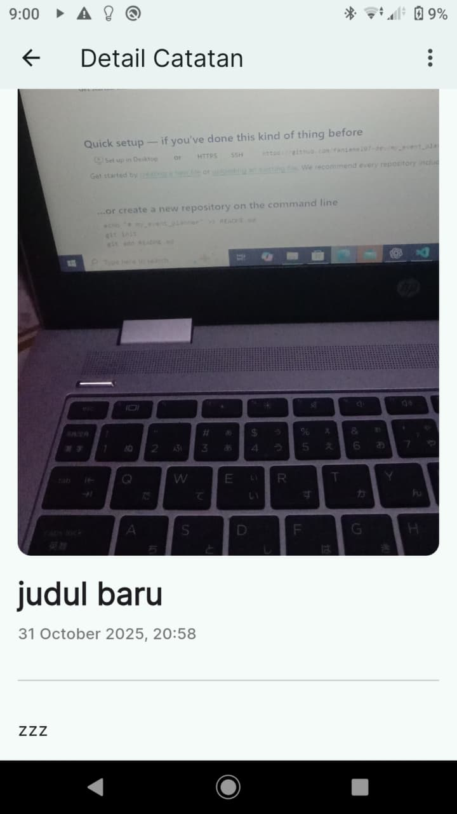
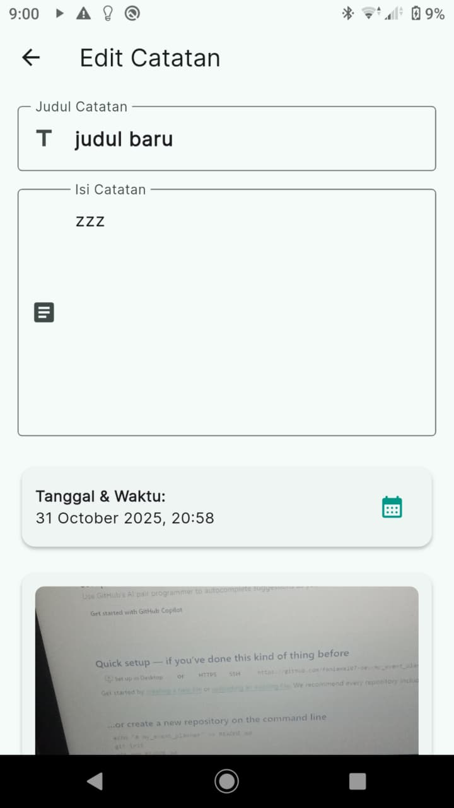
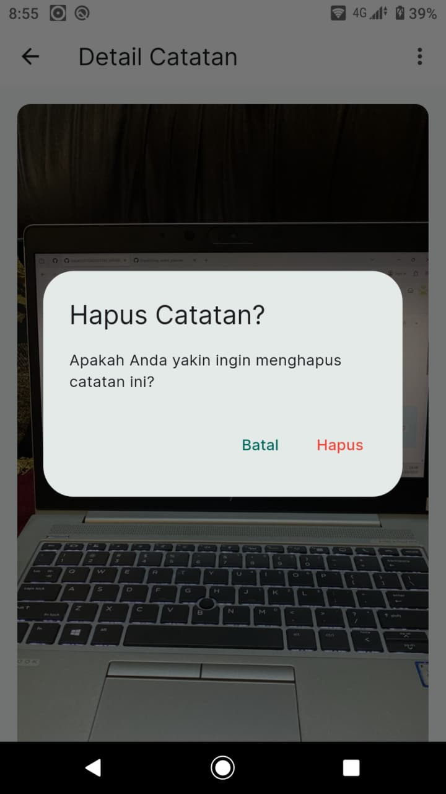
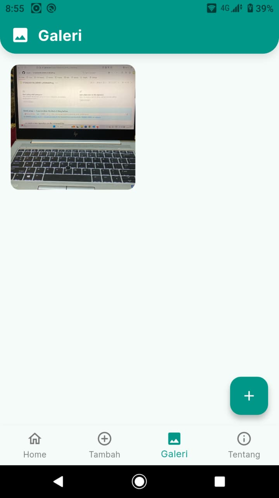

# 📱 Personal Journal

### Tugas UTS Mobile Programming (NIM Ganjil)

**Nama:** Fani Amalia Riswati
**NIM:** STI202303652
**Kelas:** C5.2
**Mata Kuliah:** Mobile Programming
**Dosen Pengampu:** Nicolaus Euclides Wahyu, S.Kom., M.CS.

---

## 📖 Deskripsi Singkat

**Personal Journal** adalah aplikasi catatan pribadi berbasis **Flutter** untuk Android.
Aplikasi ini memungkinkan pengguna membuat, menyimpan, dan mengelola catatan harian yang dapat berisi teks, gambar, serta kategori tertentu.

Semua data disimpan **secara lokal** menggunakan database **Hive**, sehingga aplikasi dapat digunakan **offline** tanpa kehilangan data.

---

## 🚀 Fitur Utama dan Alur Pengguna

### 1️⃣ Navigasi Utama

Aplikasi menggunakan **Bottom Navigation Bar** dengan tiga menu utama:

* **Home**
* **Tambah**
* **Galeri**

Serta satu **Floating Action Button (FAB)** di kanan bawah untuk menambah catatan baru.

   
  <em>Gambar 1. Tampilan Navigasi Utama</em>

---

### 2️⃣ Halaman Home (Beranda)

Menampilkan semua catatan pengguna dalam format **Grid View (2 kolom)**.
Fitur tambahan:

* **Filter kategori:** All, Important, To-do
* **Menu elipsis (...):** membuka halaman *Tentang Aplikasi*

   
  <em>Gambar 2. Tampilan Halaman Home</em>

---

### 3️⃣ Manajemen Catatan

#### 📝 Membuat Catatan

* Tombol FAB (+) membuka halaman editor.
* Input: Judul, Konten, Kategori, Gambar, Tanggal/Waktu.
* Disimpan otomatis dengan timestamp dan warna acak.

   
  <em>Gambar 3. Halaman Editor Catatan</em>

   
  <em>Gambar 4. Fitur Date/Time Picker</em>

---

#### 📖 Membaca Catatan

Menampilkan catatan secara penuh (read-only).
Tersedia tombol **Edit** di pojok kanan atas.

   
  <em>Gambar 5. Halaman Detail Catatan</em>

---

#### ✏️ Mengedit Catatan

* Bisa dilakukan dari menu elipsis atau dari halaman detail.
* Membuka kembali halaman editor dengan data lama yang bisa diperbarui.

   
  <em>Gambar 6. Menu Elipsis (Edit & Hapus)</em>

---

#### 🗑️ Menghapus Catatan

* Pilih **Hapus** dari menu elipsis.
* Dialog konfirmasi muncul sebelum penghapusan permanen.

   
  <em>Gambar 7. Dialog Konfirmasi Hapus</em>

---

## 📊 Fitur Pendukung

---

### 1️⃣ Halaman Galeri

Menampilkan semua gambar dari catatan pengguna dalam format **Grid View**.
Klik gambar untuk melihat *preview* ukuran penuh.

   
  <em>Gambar 9. Halaman Galeri</em>

---

### 2️⃣ Halaman Tentang Aplikasi

Berisi informasi aplikasi seperti versi dan pembuat.

---

## ⚙️ Spesifikasi Teknis

| Komponen         | Detail                                   |
| ---------------- | ---------------------------------------- |
| Framework        | Flutter                                  |
| Database         | Hive (Local NoSQL)                       |
| State Management | StatefulWidget & ValueListenableBuilder  |
| Tema             | Gelap (utama) dan Terang (Editor/Detail) |
| Font             | Custom (MyFont)                          |

### 📦 Dependensi Utama

* `hive` / `hive_flutter` — database lokal
* `image_picker` — ambil gambar dari galeri/kamera
* `intl` — format tanggal & waktu
* `path_provider` — direktori penyimpanan database

---

## 🔗 Link Proyek

[📁 GitHub Repository](https://github.com/faniamal07-dev/STI202303652_FANIAMALIARISWATIRISWATI_UTSMOBPRO)

---

